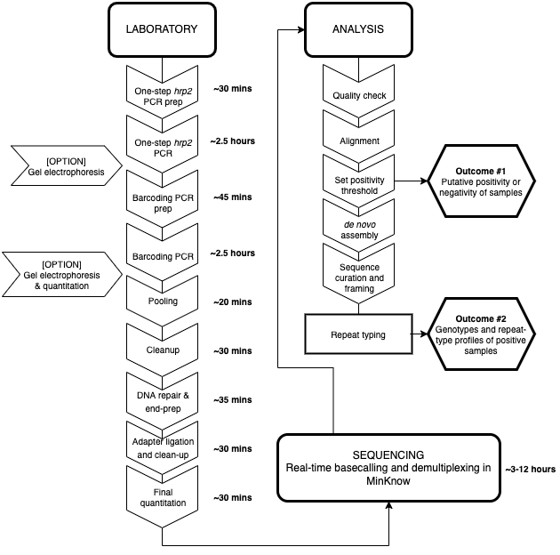

# Portable and cost-effective genetic detection and characterization of _Plasmodium falciparum hrp2_ using the MinION sequencer  

This repository contains scripts, Jupyter notebooks, and visualizations supporting the manuscript "Portable and cost-effective genetic detection and characterization of _Plasmodium falciparum hrp2_ using the MinION sequencer" (under revision).

The **analysis** folder contains scripts and Jupyter notebooks used to analyze MinION sequencing data following basecalling and barcoding with MinKnow (Oxford Nanopore Technologies), as performed during sequencing.

- **alignment** with minimap2 
- **alignment cleanup and assessment** with samtools and Qualimap
- **de novo assembly** with canu
- figure generation and **coverage threshold calculations** with python
- **repeat-typing** with python

*Workflow diagram*